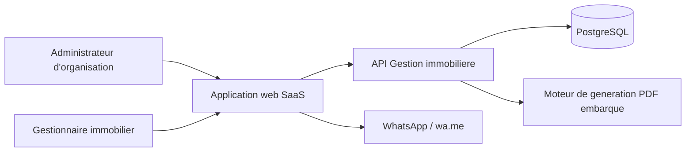
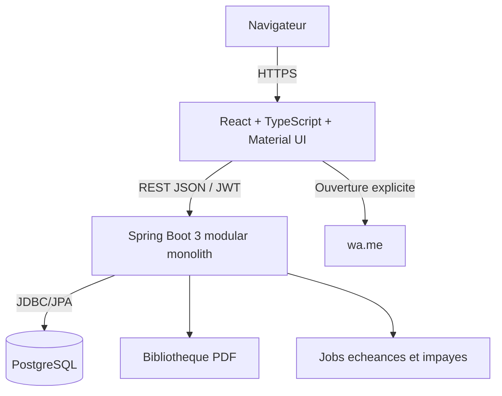
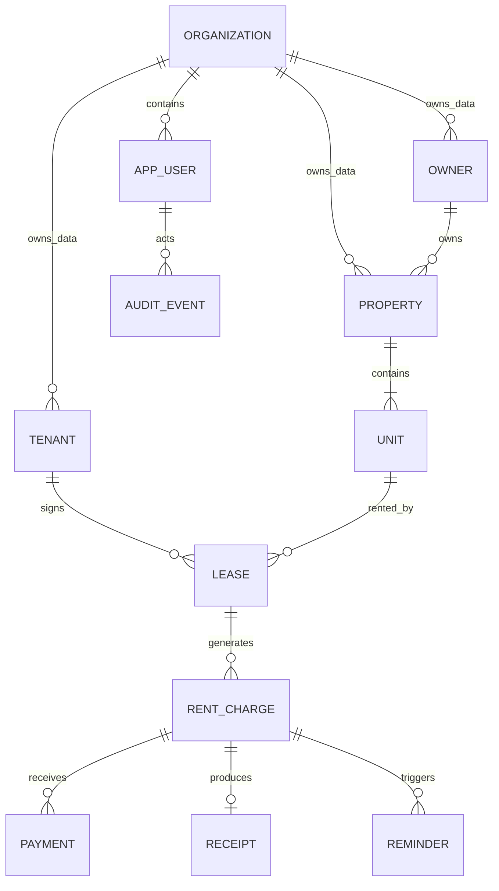
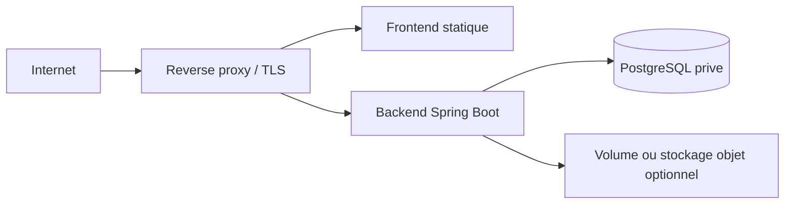

# Architecture technique proposee

## 1. Statut et objectifs

Cette proposition cible le MVP de la plateforme SaaS de gestion immobiliere pour le Senegal. Elle privilegie une architecture facile a construire et exploiter par une petite equipe, tout en protegeant deux contraintes majeures : l'isolation multi-tenant et l'exactitude des donnees financieres.

Objectifs qualite prioritaires :

1. Securite et confidentialite entre organisations.
2. Fiabilite des baux, echeances, paiements et quittances.
3. Simplicite de livraison et d'exploitation.
4. Testabilite des regles dependant du temps.
5. Evolutivite par modules sans microservices prematures.

## 2. Vue de contexte



WhatsApp n'est pas integre comme service d'envoi dans le MVP. L'application prepare un message et ouvre volontairement un lien `wa.me` dans le navigateur ou l'application de l'utilisateur.

## 3. Choix architectural

### 3.1 Style general

- **Backend** : monolithe modulaire Spring Boot 3 / Java 21.
- **Frontend** : application React TypeScript autonome, servie comme artefact statique.
- **Communication** : API REST JSON sur HTTPS, prefixee `/api/v1`.
- **Persistance** : une base PostgreSQL partagee, schema partage, lignes partitionnees logiquement par `organization_id`.
- **Migrations** : Flyway au demarrage controle ou dans une etape de deploiement dediee.
- **Authentification** : JWT emis par le backend pour le MVP.
- **Traitements temporels** : ordonnanceur Spring dans une seule instance active ou avec verrou distribue si plusieurs replicas.

Le monolithe modulaire permet des transactions locales simples pour les paiements et echeances. Les modules pourront etre extraits plus tard seulement si des besoins de charge, d'equipe ou d'isolation operationnelle le justifient.

### 3.2 Vue conteneurs



## 4. Modules backend

Organisation recommandee par fonctionnalite, chaque module contenant ses couches `api`, `application`, `domain` et `infrastructure` lorsque necessaire :

| Module | Responsabilite | Dependances metier autorisees |
|---|---|---|
| `identity` | utilisateurs, mots de passe, roles, JWT | `organization`, `audit` |
| `organization` | organisation et contexte tenant | `audit` |
| `owner` | proprietaires | `organization`, `audit` |
| `property` | biens et unites | `owner`, `organization`, `audit` |
| `tenant` | locataires | `organization`, `audit` |
| `lease` | baux, conditions, activation et fin | `property`, `tenant`, `organization`, `audit` |
| `billing` | echeances, paiements, soldes et impayes | `lease`, `organization`, `audit` |
| `reminder` | modele et historique des relances | `billing`, `tenant`, `audit` |
| `receipt` | numerotation, donnees figees et PDF | `billing`, `lease`, `owner`, `tenant`, `audit` |
| `dashboard` | projections et indicateurs | lectures de `property`, `lease`, `billing` |
| `audit` | traces des actions sensibles | aucune dependance metier |
| `shared` | erreurs, types techniques, horloge | aucune logique metier specifique |

Regles :

- Pas de dependance circulaire.
- Un module ne lit pas directement les tables internes d'un autre pour implementer une commande metier.
- Les lectures de tableau de bord peuvent utiliser des projections SQL optimisees, documentees comme read models.
- Les entites JPA et repositories restent internes au module.
- Les interactions synchrones passent par des services applicatifs/interfaces publiques ; des evenements internes peuvent decoupler audit et projections sans exiger de broker.

## 5. Structure backend indicative

```text
backend/
  src/main/java/.../
    identity/
      api/
      application/
      domain/
      infrastructure/
    organization/
    owner/
    property/
    tenant/
    lease/
    billing/
    reminder/
    receipt/
    dashboard/
    audit/
    shared/
  src/main/resources/
    db/migration/
    application.yml
```

Cette structure est une direction, pas une obligation de creer quatre sous-packages lorsque le module reste trivial.

## 6. Architecture frontend

Le frontend est organise par fonctionnalite et partage uniquement les briques transverses reelles.

```text
frontend/src/
  app/                 # bootstrap, routes, providers, theme
  features/
    auth/
    owners/
    properties/
    tenants/
    leases/
    billing/
    reminders/
    receipts/
    dashboard/
  shared/
    api/
    components/
    hooks/
    formatting/
    validation/
    types/
```

Principes :

- React Router pour la navigation.
- Material UI pour composants, theme et accessibilite de base.
- Une bibliotheque de requetes serveur telle que TanStack Query est recommandee pour cache, invalidation et etats reseau.
- React Hook Form avec un schema de validation TypeScript peut etre utilise pour les formulaires.
- Le client API peut etre genere depuis OpenAPI ou maintenu de facon strictement typee.
- Les statuts financiers et calculs proviennent du backend ; le frontend ne les reinvente pas.
- Les erreurs Problem Details sont transformees en messages francais actionnables.

### Gestion des jetons

Option recommandee avant arbitrage final : access token JWT court conserve en memoire, refresh token opaque ou JWT avec rotation place dans un cookie `HttpOnly`, `Secure`, `SameSite` adapte. Si le MVP retient un access token seul, sa duree doit etre courte et le risque UX explicitement accepte. Eviter le stockage durable d'un jeton longue duree dans `localStorage`.

## 7. Modele de donnees conceptuel



### Entites principales

**Organization**

- `id`, `name`, `status`, informations de contact, `created_at`, `updated_at`.

**AppUser**

- `id`, `organization_id`, `email`, `password_hash`, `role`, `status`, dernier acces et audit.

**Owner**

- `id`, `organization_id`, type personne/entreprise, nom/raison sociale, telephone, email, adresse, statut archive.

**Property**

- `id`, `organization_id`, `owner_id`, libelle, type, adresse, localite, region, statut.

**Unit**

- `id`, `organization_id`, `property_id`, libelle, type, surface, nombre de pieces, statut administratif.
- Contrainte unique recommandee : `(organization_id, property_id, normalized_label)`.

**Tenant**

- `id`, `organization_id`, nom, telephone E.164, email, adresse, reference d'identite facultative et statut archive.

**Lease**

- `id`, `organization_id`, `unit_id`, `tenant_id`, date debut/fin, loyer XOF, periodicite, jour d'echeance, statut et version optimiste.
- Le chevauchement de baux doit etre bloque par le service metier dans une transaction. Une contrainte PostgreSQL d'exclusion peut etre envisagee apres validation de la modelisation des plages de dates.

**RentCharge**

- `id`, `organization_id`, `lease_id`, periode, date limite, montant du fige, montant paye derive/materialise, statut.
- Unicite : `(organization_id, lease_id, period_start)`.

**Payment**

- `id`, `organization_id`, `rent_charge_id`, montant, date de paiement, mode, reference, statut, cle d'idempotence, auteur et audit.
- Une annulation change le statut ou cree une ecriture compensatoire ; elle ne supprime pas la ligne.

**Receipt**

- `id`, `organization_id`, `rent_charge_id`, numero, donnees figees necessaires au document, hash/version, date de generation et statut.
- Unicite du numero par organisation et au plus une quittance valide par echeance.

**Reminder**

- `id`, `organization_id`, `rent_charge_id`, canal, numero cible, contenu ou reference de modele selon arbitrage, auteur et date de preparation.

**AuditEvent**

- `id`, `organization_id`, `actor_user_id`, action, type/id de cible, instant, correlation_id et metadonnees non sensibles.

## 8. Multi-tenancy

### Strategie MVP

Toutes les organisations partagent la meme base et le meme schema. Chaque ligne metier porte un `organization_id NOT NULL`.

Defense en profondeur :

1. Le JWT identifie l'utilisateur et son organisation.
2. Un `TenantContext` serveur est construit apres validation du jeton.
3. Les services applicatifs transmettent explicitement l'organisation aux repositories.
4. Les requetes filtrent toujours sur `organization_id` et l'identifiant de ressource.
5. Les cles et contraintes evitent les references inter-organisations.
6. Les tests tentent systematiquement des acces croises.

PostgreSQL Row-Level Security peut etre ajoute comme couche supplementaire, mais ne doit pas etre adopte sans mecanisme fiable de propagation du contexte par transaction et tests operationnels. Pour le MVP, des repositories tenant-aware et des contraintes composites explicites offrent une mise en oeuvre plus simple a verifier.

Comportement recommande pour une ressource d'un autre tenant : retourner `404 Not Found` afin de ne pas confirmer son existence.

## 9. Authentification et autorisation

### Authentification

- Email normalise et mot de passe hash avec Argon2id ou BCrypt configure.
- Jetons signes avec un algorithme fixe et des cles/secrets fournis par l'environnement.
- Claims minimaux : `sub`, `organization_id`, `roles`, `iat`, `exp`, `jti`.
- Validation stricte de signature, expiration, issuer et audience si configures.
- Rate limiting de la connexion avant exposition publique.

### Autorisation

- `ADMIN` : gestion des utilisateurs, annulation de paiements et toutes les fonctions du gestionnaire.
- `GESTIONNAIRE` : referentiels, baux, loyers, relances et quittances.
- Controle au niveau endpoint et cas d'usage ; le masquage d'un bouton frontend n'est jamais une autorisation.
- Le statut actif de l'utilisateur et de l'organisation doit pouvoir etre revalide pour les operations sensibles selon la strategie de jeton.

## 10. API REST

### Conventions

- Base : `/api/v1`.
- JSON en `camelCase`, dates ISO 8601, montants sous forme d'entiers XOF.
- Pagination bornee, par exemple `page`, `size`, `sort`, avec taille maximale.
- DTO de creation, mise a jour et lecture distincts lorsque leurs contraintes different.
- Erreurs `application/problem+json` avec `type`, `title`, `status`, `detail`, `instance`, `code`, `fieldErrors` et `correlationId` si pertinent.
- OpenAPI constitue le contrat partage avec le frontend.

### Ressources indicatives

```text
POST   /api/v1/auth/login
POST   /api/v1/auth/refresh
GET    /api/v1/users
POST   /api/v1/users

GET    /api/v1/owners
POST   /api/v1/owners
GET    /api/v1/owners/{id}
PATCH  /api/v1/owners/{id}

GET    /api/v1/properties
POST   /api/v1/properties
POST   /api/v1/properties/{id}/units

GET    /api/v1/tenants
POST   /api/v1/tenants

GET    /api/v1/leases
POST   /api/v1/leases
POST   /api/v1/leases/{id}/terminate

GET    /api/v1/rent-charges
POST   /api/v1/rent-charges/{id}/payments
POST   /api/v1/payments/{id}/cancel

POST   /api/v1/rent-charges/{id}/reminder-preview
POST   /api/v1/rent-charges/{id}/reminders

POST   /api/v1/rent-charges/{id}/receipt
GET    /api/v1/receipts/{id}/pdf

GET    /api/v1/dashboard/summary
```

Les routes finales seront figees pendant la conception des stories ; cette liste exprime les responsabilites, pas un contrat deja implemente.

### Concurrence et idempotence

- Version optimiste (`@Version`) recommandee sur baux, echeances et paiements sensibles aux mises a jour concurrentes.
- Une cle `Idempotency-Key` est recommandee pour l'enregistrement de paiement et la generation d'echeances/quittances.
- Le calcul et l'insertion d'un paiement s'executent dans une transaction avec verrouillage approprie de l'echeance pour empecher un depassement concurrent.

## 11. Cycle des baux et loyers

### Statuts indicatifs

- Bail : `DRAFT`, `ACTIVE`, `TERMINATED`, `CANCELLED`.
- Echeance : `A_VENIR`, `A_PAYER`, `PARTIEL`, `PAYE`, `EN_RETARD`, `ANNULEE`.
- Paiement : `CONFIRME`, `ANNULE`.
- Quittance : `VALIDE`, `INVALIDEE`.

Les noms definitifs peuvent evoluer, mais une machine a etats explicite doit eviter les combinaisons incoherentes.

### Generation d'echeances

- A l'activation, creer les echeances necessaires pour un horizon court ou la periode courante.
- Un job quotidien complete l'horizon et recalcule les statuts arrives a echeance.
- L'unicite `(organization_id, lease_id, period_start)` rend le traitement rejouable.
- Pour un jour absent d'un mois, utiliser le dernier jour du mois, sous reserve d'arbitrage produit.
- L'horloge est injectee et le fuseau metier est `Africa/Dakar`.
- La proratisation de debut/fin de mois reste a arbitrer avant implementation.

### Paiement

Dans une transaction :

1. Charger l'echeance dans l'organisation avec verrou/version.
2. Verifier statut, montant positif et absence de depassement.
3. Inserer le paiement avec sa cle d'idempotence.
4. Recalculer le cumul des paiements confirmes et le statut.
5. Emettre une trace d'audit apres succes transactionnel.

## 12. Detection des impayes

La source de verite est le solde de chaque echeance :

```text
solde = montant_du - somme(paiements_confirmes)
en_retard = solde > 0 ET date_limite < date_metier
```

Le statut peut etre recalcule a la lecture pour garantir l'exactitude, puis materialise par un job pour faciliter filtres et tableaux de bord. Si le statut est materialise, toute mutation de paiement doit le recalculer dans la meme transaction.

Le job :

- s'execute quotidiennement selon `Africa/Dakar` ;
- traite par lots et par organisation ;
- est idempotent ;
- expose compteurs de succes/echec ;
- utilise un verrou distribue en cas de plusieurs instances applicatives.

## 13. Relances WhatsApp

Le MVP ne depend pas de l'API WhatsApp Business.

Flux :

1. Le gestionnaire selectionne une echeance avec solde positif.
2. Le backend retourne les donnees fiables et un texte propose.
3. Le frontend affiche un apercu modifiable.
4. Apres confirmation, le frontend encode le numero E.164 sans `+` et le message dans un lien `wa.me`.
5. Une trace `PREPARED` peut etre enregistree, sans pretendre a un envoi ou une livraison.

Exemple de modele, a valider par le Product Owner :

```text
Bonjour {nomLocataire}, nous vous rappelons que le loyer de {periode}, d'un solde de {soldeXof} XOF, etait attendu le {dateEcheance}. Merci de nous contacter pour regulariser votre situation.
```

Le contenu libre doit etre traite comme donnee non fiable pour l'affichage et correctement encode dans l'URL.

## 14. Quittances PDF

### Strategie MVP

- Generation cote backend a partir d'un modele controle.
- Bibliotheque Java maintenue et compatible licence projet, a choisir lors de l'implementation.
- Les donnees legales et financieres sont figees dans `receipt` ou un snapshot JSON structure au moment de l'emission.
- Le numero est genere transactionnellement, unique par organisation.
- Une quittance logique ne doit pas recevoir plusieurs numeros lors de retries.

### Contenu minimal

- Numero et date d'emission.
- Identite de l'organisation/gestionnaire et du proprietaire.
- Identite du locataire.
- Adresse du bien et unite.
- Periode concernee.
- Montant du et montant acquitte en XOF.
- Date(s) de paiement ou date de completude.
- Mention de quittance et eventuelles mentions legales validees.

### Stockage

Pour le MVP, deux options sont acceptables :

- regenerer le PDF deterministement depuis le snapshot en base ;
- stocker le binaire dans un volume/stockage objet et conserver son hash et chemin.

La regeneration depuis snapshot est recommandee pour limiter l'infrastructure, a condition que le moteur et le modele soient versionnes afin de preserver le rendu historique. Le choix final doit etre capture avant implementation de E9.

## 15. Audit et observabilite

### Audit fonctionnel

Actions prioritaires : authentification, changement de role/statut, creation/modification/fin de bail, creation/annulation de paiement, relance et quittance.

Une trace comprend : organisation, acteur, action, cible, instant UTC, correlation ID et metadonnees minimales. Elle ne contient pas de JWT, mot de passe ou document personnel complet.

### Observabilite technique

- Logs structures avec niveaux coherents et correlation ID.
- Spring Boot Actuator pour health, readiness et metriques.
- Metriques : latence/erreurs HTTP, connexions refusees, echeances traitees, jobs en echec, PDF generes.
- Aucune forte cardinalite non bornee dans les labels de metriques.

## 16. Securite applicative

- TLS obligatoire hors environnement local.
- CORS limite aux origines configurees.
- En-tetes de securite au proxy et/ou backend.
- Bean Validation, requetes parametrees et encodage contextuel contre injection/XSS.
- Pas d'entites de persistence exposees directement.
- Controles MIME et `Content-Disposition` pour les PDF.
- Messages d'erreur sans stack trace ni information de tenant.
- Analyse des dependances et images dans la CI.
- Comptes de base et conteneurs avec privileges minimaux.
- Sauvegardes chiffrees et acces restreint en production.

## 17. Deploiement et configuration

### Local

Docker Compose orchestre PostgreSQL, backend et frontend. Les donnees PostgreSQL resident dans un volume nomme. Des valeurs locales non sensibles peuvent etre fournies dans un fichier exemple.

### Environnements distants

Architecture minimale :



Variables attendues, sans valeurs dans le depot :

- URL et identifiants PostgreSQL.
- Cle/secret JWT, issuer, audience et durees.
- Origines CORS.
- Fuseau metier et parametres de jobs.
- Parametres de stockage PDF si utilise.
- Niveau de logs et configuration Actuator.

Flyway doit etre execute de maniere controlee par une instance/job unique avant la mise a disposition de la nouvelle version.

## 18. Strategie de tests

### Backend

- Unitaires : machines a etats, dates, soldes, chevauchement de bail et modeles de relance.
- Integration Testcontainers/PostgreSQL : repositories tenant-aware, contraintes, Flyway, concurrence de paiement.
- Web/security : JWT, roles, erreurs Problem Details et acces inter-tenant.
- PDF : presence des champs, type de contenu, autorisation et reproductibilite logique.

### Frontend

- Composants : formulaires, validations, tableaux et etats d'erreur.
- Integration : API simulee/controlee, session et workflows.
- Accessibilite : labels, clavier, focus et contraste sur parcours principaux.

### End-to-end

- Parcours complet jusqu'a la quittance.
- Impaye, paiement partiel et relance WhatsApp.
- Deux organisations avec tentative d'acces croise.

## 19. Performance et capacite MVP

- Pagination obligatoire et taille maximale de page.
- Index tenant-aware sur recherches courantes.
- Eviter les N+1 JPA avec projections ou fetch explicites.
- Jobs traites par lots.
- Les tableaux de bord utilisent des aggregations SQL et non le chargement de toutes les lignes.
- Definir avec QA un jeu de reference avant test de performance, par exemple plusieurs milliers d'echeances par organisation.

Les objectifs chiffres de latence et volumetrie doivent etre fixes avant production ; ne pas inventer un SLA sans donnees d'usage.

## 20. Decisions differees

- Regle de prorata de loyer.
- Contenu legal final des quittances.
- Stockage ou regeneration des PDF.
- Access/refresh token et mecanisme de revocation exact.
- Activation eventuelle de PostgreSQL Row-Level Security.
- Bibliotheques definitives PDF, query state et formulaires.
- Hebergement cible et solution de secrets/sauvegardes.

Ces choix doivent etre tranches au plus tard avant la story qui en depend et documentes sous forme d'ADR si leur impact est transversal.

## 21. Evolutions post-MVP envisageables

- Paiements mobile money et rapprochement bancaire.
- Envoi WhatsApp Business asynchrone avec webhooks de statut.
- Portails proprietaires et locataires.
- Gestion des charges, depots, penalites, travaux et documents.
- Stockage objet dedie et generation PDF asynchrone.
- Read models avances ou extraction de services si la charge le justifie.

Ces extensions ne doivent pas complexifier l'implementation initiale au-dela de points d'extension simples et documentes.
